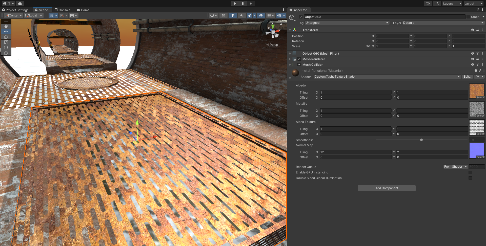

# Custom Alpha Texture Shader for Unity

A custom Unity shader that enables physically-based rendering with a separate alpha texture for precise control over transparency, supporting albedo, metallic, smoothness, and normal maps.

## Features

- Physically-based rendering
- Separate alpha texture control
- Support for albedo, metallic, smoothness, and normal maps
- Compatible with Unity's standard lighting and shading

## Installation

1. Download or clone this repository.
2. Import the shader into your Unity project by copying the `.shader` file into your project's `Assets` directory.
3. Create a material that uses this shader and assign it to the objects you want to render with the custom alpha texture effect.

## Usage

- **Albedo**: Main color texture.
- **Metallic**: Metallic properties texture.
- **Alpha Texture**: Separate texture for controlling transparency (white is opaque, black is transparent).
- **Smoothness**: Controls the surface glossiness.
- **Normal Map**: Normal map for simulating surface details.

Assign the corresponding textures and adjust the smoothness parameter within the material inspector in Unity.

## Contributing

Feel free to fork this repository and submit pull requests for any enhancements or fixes. Issues and feedback are also appreciated.

## License

This project is licensed under the MIT License. See the [LICENSE](LICENSE) file for details.

